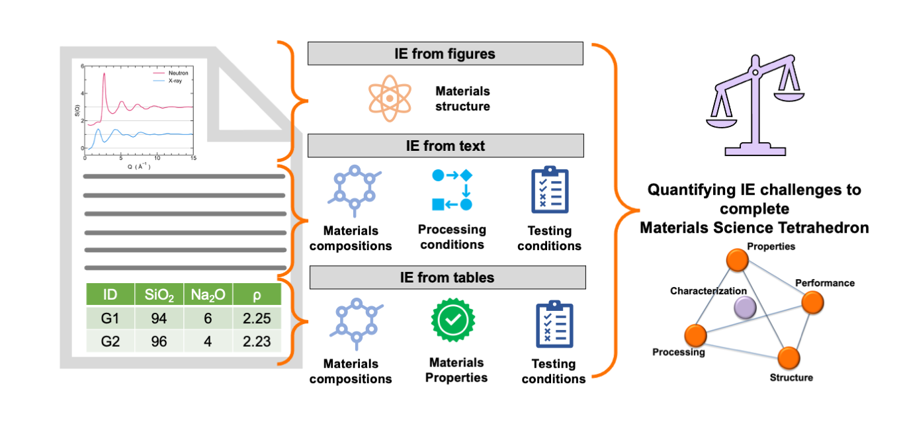

# Reconstructing Materials Tetrahedron: Challenges in Materials Information Extraction

## Link to paper - [Click here](https://pubs.rsc.org/en/content/articlehtml/2024/dd/d4dd00032c)



### This repository consists of following folders:
1. [challenges](https://github.com/M3RG-IITD/MatSci-IE-Challanges/tree/main/challenges): Details of different challenges discussed in the paper alongwith the links to their examples
2. [notebooks](https://github.com/M3RG-IITD/MatSci-IE-Challanges/tree/main/notebooks): Jupyter Notebooks verifying the different challenges reported in the paper
3. [paper_links](https://github.com/M3RG-IITD/MatSci-IE-Challanges/tree/main/paper_links): List of all the research papers investigated for finding challenges

## Citing
You can cite this work as
```
@article{hira2023reconstructing,
  title   =  {Reconstructing Materials Tetrahedron: Challenges in Materials Information Extraction},
  author  = {"Hira, Kausik and 
             Zaki, Mohd and 
             Sheth, Dhruvil and
             Krishnan, NMA and
             Mausam"
  },
  journal = {arXiv preprint arXiv:2310.08383},
  year    = {2023}
}
```
